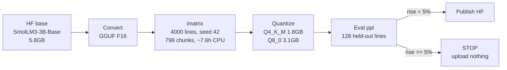
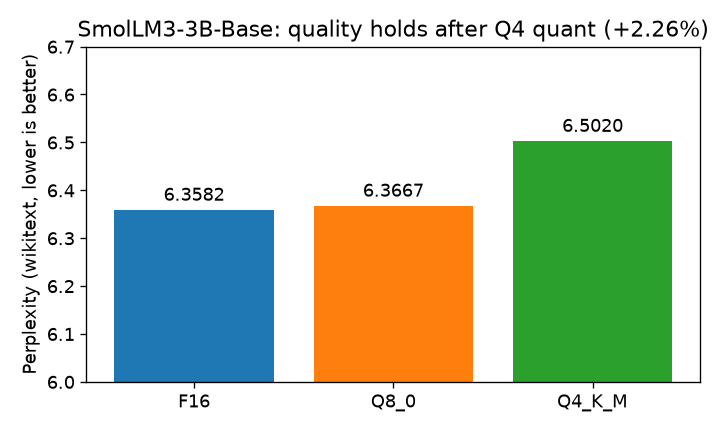
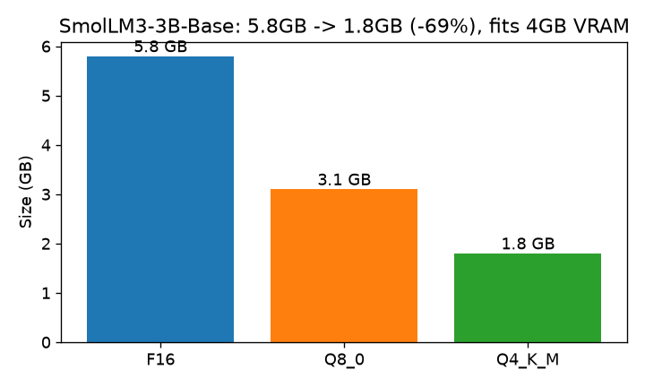

# SmolLM3-3B-Base GGUF — verified 4GB edge build

[](https://huggingface.co/ShayonSarker/SmolLM3-3B-Q4_K_M-GGUF)
[](https://huggingface.co/HuggingFaceTB/SmolLM3-3B-Base)
[]()
[]()

A 3B model that runs **fully offline on a 4GB GTX 1650** — built with an importance-matrix quant, measured honestly, gated before publish. **5.8GB → 1.8GB (−69%)** for a **+2.26%** perplexity cost.

## Pipeline



## Results (measured on Kaggle T4 CPU, verified locally)

| model | PPL ↓ | size | Δ vs F16 |
|---|---|---|---|
| F16 | 6.3582 | 5.8 GB | — |
| Q8_0 | 6.3667 | 3.1 GB | +0.14% |
| **Q4_K_M** | **6.5020** | **1.8 GB** | **+2.26%** ✅ |




Local proof (GTX 1650 4GB, Ollama, offline): **2255MB / 4096MB** VRAM with Q4 loaded. Download verified byte-exact vs `SHA256.txt`.

## Try it (30 seconds)

```
ollama create smollm3-3b-base-q4 -f Modelfile
ollama run smollm3-3b-base-q4 "Explain overfitting in 3 lines."
```

Real output from this build:

> Overfitting is a problem that occurs when a model is too complex and starts to fit the noise in the data rather than the underlying pattern. This can lead to poor performance on new data… Use a simpler model: a simpler model will be less likely to overfit the data.

llama.cpp:
```
./llama-cli -m smol-Q4_K_M.gguf -p "Explain overfitting in 3 lines." -c 4096
```

## Reproduce (one command, Kaggle T4)

```
bash master-run.sh 2>&1 | tee master.log
```

Skips finished steps on re-run. Fails loudly on bad quality instead of publishing junk.

## Honest limitations

* **Base model, not instruct** — raw completion; creative prompts can loop (verified: haiku prompt degenerated into repetition). Prompt accordingly.
* **Perplexity-only validation** — no ARC/HellaSwag task scores. Stated, not hidden.
* **English wikitext calibration** — other languages/domains may vary.

## Repo contents

| file | what |
|---|---|
| `master-run.sh` | full one-shot pipeline (this run) |
| `quant.sh` / `eval.sh` | quant + eval steps standalone |
| `Modelfile` | Ollama build |
| `REPRO.json` / `SHA256.txt` | proof: numbers + hashes (from HF) |
| `ppl.png` / `size.png` | charts above, generated from measured numbers |

Model weights live on 🤗 [ShayonSarker/SmolLM3-3B-Q4_K_M-GGUF](https://huggingface.co/ShayonSarker/SmolLM3-3B-Q4_K_M-GGUF) (kept out of git — 5GB+).
